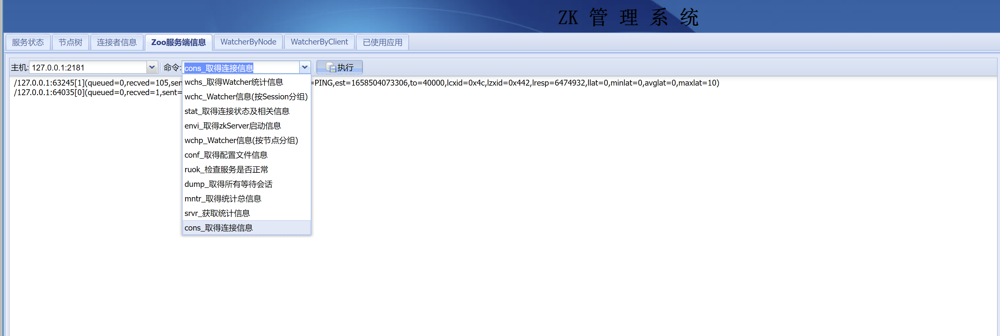

### zookeeper在线后台管理
```
作者:孤狼 联系方式:zuiwoxing@qq.com
```
```
项目介绍:
该项目实现了以下功能 :
 1.提供zookeeper节点管理. 
 2.ZK服务状态查看. 
 3.zookeeper每个节点的watcher查看。 
 4.以客户端连接分组查看watcher
 5.zk常用命令行。 
 6.查看所有连接客户端 
 7.已使用应用作业，是用来统计所有已使用统一配置的APP应用， 可以用来动态管理APP通用配置
 
```
```
项目安装:
 1. 下载项目
 git clone https://github.com/openandopen/zk-manager.git
 2. 打包项目
 mvn clean package -DskipTests
 3. 运行项目
 java -jar zk-manager.war
 4.访问地址: http://localhost:8888
 默认:root:root123, guest/guest
 
 大家根据需要修改application.properties中的password。其中password为MD5(zuiwoxing:+{userpwd})
```
 
```
 后台管理界面 
```
### 1. dashbard

### 2. 节点树管理(右键进行节点操作)

### 3. 连接信息

### 4. ZK常用命令

